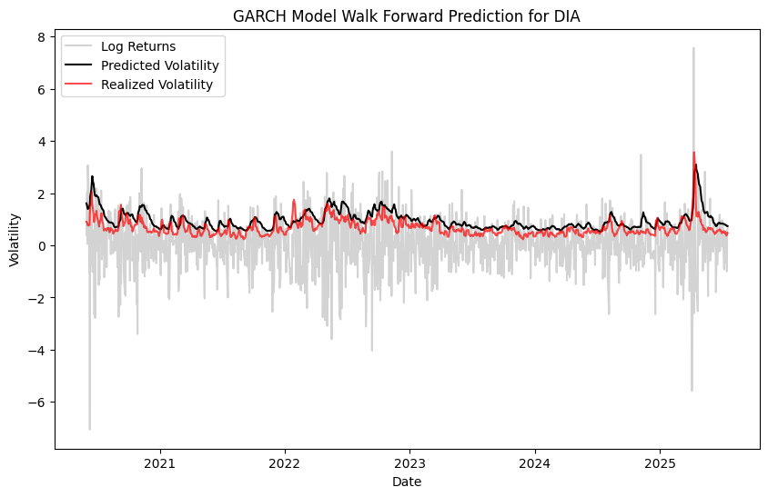
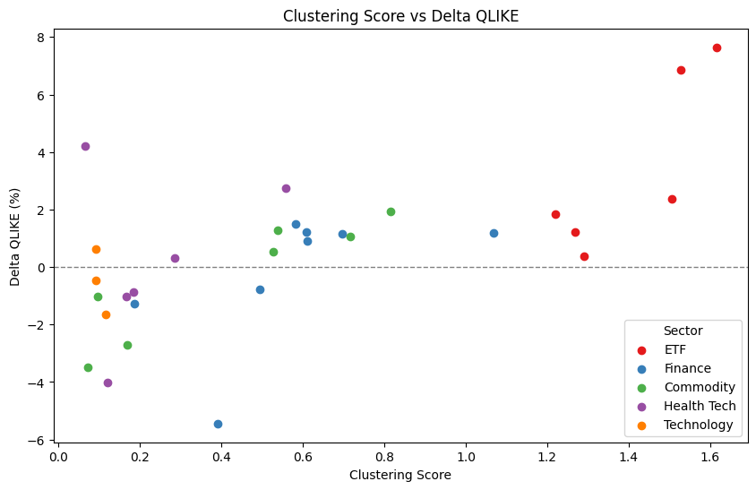

# Stock volatility prediction
The stock prices of financial assets vary over time. The degree of variation of the stock price is expressed by volatility. Mathematically, the volatility is equivalent to the standard deviation of the stock price over time. Volatily forecasting can be advantageous in trading as it can be used for risk assessment, option pricing, strategy selection etc.
 
The goal of this project is to learn and implement time series analysis to forecast volatility of log returns using historical open, high, low, close, volume (OHLCV) data with a GARCH(1,1) model. We use historical daily stock data from Alpha Vantage API.
 
Stock returns often exhibit volatility clustering — periods of high volatility followed by high volatility. The GARCH(1,1) model captures this by modeling the conditional variance of returns based on past shocks and past volatility.
 

## Methodology
- Returns are calculated as log differences of closing prices: $$r_t=ln\left(\frac{P_t}{P_{t-1}}\right)$$.
- Stock data from multiple sectors including Finance, ETFs, Healthcare, Technology, and Commodities is used to enable a more generalized and robust analysis. 
- Each stock is assigned a clustering score based on autocorrelation of squared returns: $$\text{Clustering Score} = \sum_{l=1}^5 ACF(r_t^2, lag=l)$$

## Walk-forward validation
We implement a walk-forward approach to simulate real-world forecasting:
- Retrain the GARCH model on a rolling window
- Forecast next-day volatility
- Store predicted volatility and model parameters at each step

  
*Figure 1: Walk-forward GARCH(1,1) volatility prediction for DIA compared with realized volatility.*

## Model diagnostics
We assess model fit using both statistical tests and visual tools:
- Tests: Ljung-Box (autocorrelation), ARCH (heteroskedasticity), Jarque-Bera (normality) for standardized residuals $z_t=(r_t-\mu)/\sigma_t$.
- Visuals: Histogram, Q-Q plot, ACF plot of standardized residuals, time series of $\alpha+\beta$, and time series of predicted and realized (Parkinson estimator) volatility.

## Evaluation
To assess the accuracy of volatility forecasts, we benchmark GARCH(1,1) predictions against the Parkinson estimator of realized volatility and compare them with a simple rolling historical volatility model. Evaluation is done using multiple error metrics:
 
- MAE (Mean Absolute Error) – captures average prediction bias
- MSE / RMSE (Root Mean Squared Error) – penalizes larger deviations more heavily
- QLIKE (Quasi-Likelihood Loss) – commonly used in volatility modeling for its sensitivity to large forecast errors and changes in volatility levels over time

We evaluate model performance across assets with different levels of volatility clustering (as measured by autocorrelation of squared returns).

## Key Observations
- GARCH(1,1) consistently outperforms historical volatility for stocks and ETFs that exhibit strong volatility clustering. T
- RMSE and QLIKE show the most consistent improvements for high-clustering assets, highlighting GARCH’s strength in capturing dynamic volatility patterns. These metrics are especially important in financial applications like risk management and options pricing.- 
- Lower-clustering assets show mixed results: GARCH sometimes improves bias (MAE) but not variance (RMSE), or vice versa — indicating that no single metric fully captures performance.
- Volatility clustering scores help identify assets where GARCH is likely to be effective, serving as a useful preprocessing signal.

  
*Figure 2: Delta QLIKE (%) vs volatility clustering score. GARCH performs better on assets with higher clustering.*

## Conclusion 
Our results show that GARCH(1,1) models offer a meaningful advantage over simpler historical volatility estimates when applied thoughtfully. In particular, combining:
- Volatility clustering scoring for model selection,
- Walk-forward validation for realistic performance tracking, and
- Robust multi-metric evaluation

allows us to build more nuanced, actionable volatility forecasts for financial decision-making.

